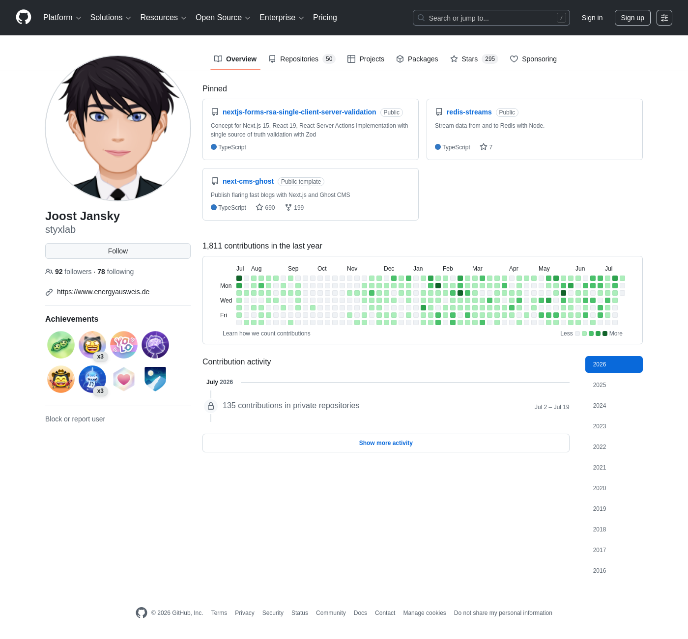

# styxlab

Personal GitHub profile for **Joost Jansky** — maintainer of [Energyausweis](https://github.com/energyausweis).

**Product and private git no longer live on GitHub.** Day-to-day development runs on a **self-hosted [Forgejo](https://forgejo.org/)** instance. This account stays on GitHub for **public material**, identity (OAuth / integrations), and **achievements** — not as the source of truth for the Energyausweis monorepo or deploys.

See also: [Energyausweis on GitHub](https://github.com/energyausweis) (org profile — public publishing surface).

---

## Why we moved product git off GitHub

We left GitHub as the host for **private and product** repositories in 2026. GitHub remains useful for **reach**; it is no longer our **source of truth**.

### 1. Sovereignty, privacy, and speed

Self-hosting gives us:

- **Control** over where data lives and who can access it  
- **Predictable performance** on our own infrastructure  
- **Clear retention and backup** policies we operate ourselves  
- **Tighter integration** with our deploy stack without coupling to an external SaaS API  

For a European product, keeping project data on infrastructure we govern also simplifies **privacy and compliance** compared to relying on a U.S.-hosted platform by default.

### 2. Independence from a U.S.-led platform

[GitHub](https://github.com) is owned by Microsoft. Many teams are uncomfortable with long-term dependence on a single U.S. corporate host for code, issues, CI metadata, and contributor identity — especially when platform direction can shift toward proprietary AI tooling, enterprise monetization, or policies maintainers do not control.

Our view: that is a **strategic risk**. We prefer a forge whose **roadmap and governance** we can reason about without betting the product on one vendor’s commercial priorities, legal exposure, or jurisdiction.

---

## Why Forgejo

We run **[Forgejo](https://forgejo.org/)** — a lightweight, self-hosted Git forge (issues, pull requests, wiki, webhooks, CI integrations).

Forgejo fits when **governance** matters: community-oriented, non-profit governance ([Codeberg e.V.](https://codeberg.org/Codeberg-e.V.)), after the Gitea project’s direction moved toward a for-profit structure.

**One line:** Forgejo for **sovereignty, privacy, speed, and independence** from U.S. corporate control.

---

## Gitea — great for community projects

We recommend **[Gitea](https://about.gitea.com/)** for **community and OSS projects** that want simple, low-maintenance self-hosted collaboration — repos, PRs, issues, wiki, webhooks — without heavy operations.

| | **Forgejo** | **Gitea** |
|---|-------------|-----------|
| **Governance** | Community / non-profit emphasis | Pragmatic, company-backed in practice |
| **Best for** | Sovereignty + community control | Easy self-hosted “GitHub-like” forge |

Also: **[Codeberg](https://codeberg.org/)** (hosted Forgejo in the EU).

---

## Contribution graph (archived)

GitHub’s live contribution graph dropped after **private and public product repos were removed** in July 2026. Achievements on this account were kept; the activity heatmap on the profile tab no longer reflects years of work.

Below is a **static screenshot** of the profile and contribution graph from **2026-07-21**, captured before deletion (warm archive).

*Snapshot only — not updated. Historical repos are preserved in an offline warm archive.*

---

## Further reading

- [Forgejo](https://forgejo.org/)  
- [Gitea](https://about.gitea.com/)  
- [Codeberg](https://codeberg.org/)  
- [Energyausweis org profile](https://github.com/energyausweis)
